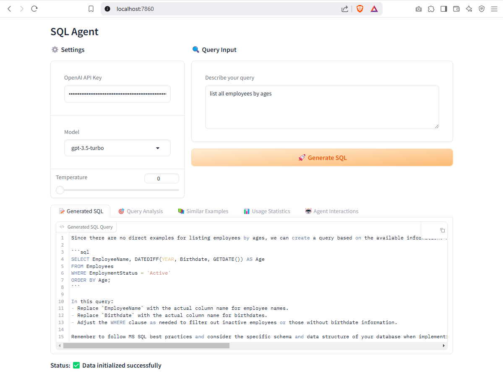
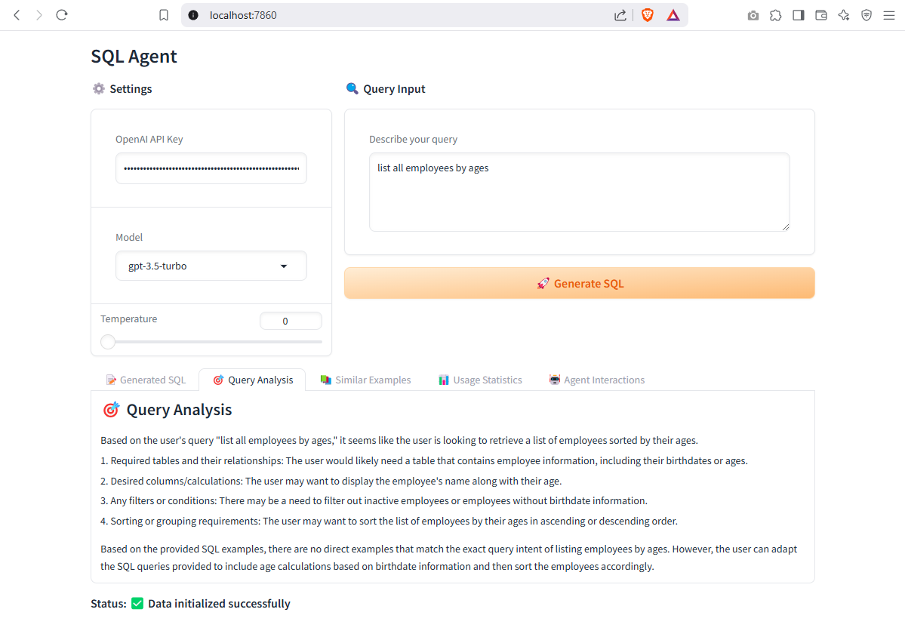
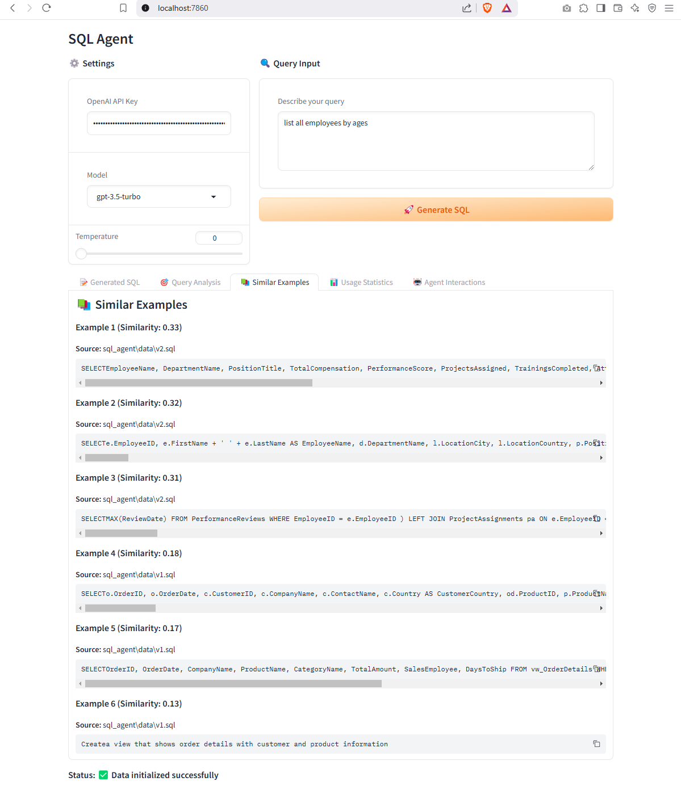
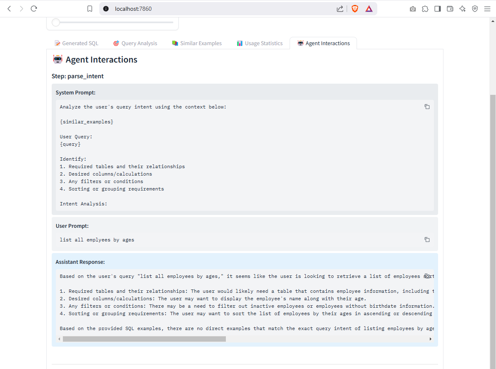

# SQL Agent v1.0.0 🚀

An AI-powered SQL query generation and analysis tool that helps you write MS SQL Server queries using natural language, leveraging RAG (Retrieval Augmented Generation) for context-aware query generation. Now a production-ready stable release!

## Features

- 🤖 Natural language to SQL query conversion
- 📊 Multi-database support with proper schema handling
- 🔍 RAG-powered context-aware query generation
- 📝 Detailed query validation and optimization
- 📈 Token usage and cost tracking
- 🎯 Vector similarity search for relevant examples
- 🧠 Advanced MS SQL Server features support
- 🎨 Elegant Gradio interface

## Screenshots






## Project Structure

```
sql_agent/
├── sql_agent/              # Main package directory
│   ├── data/              # SQL example files
│   │   ├── q1.sql        # Example queries
│   │   ├── s2.sql        # Stored procedures
│   │   ├── transactions.sql # Transaction examples
│   │   ├── v1.sql        # View definitions
│   │   └── v2.sql        # Additional views
│   ├── utils/            # Utility modules
│   │   ├── decorators.py # Function decorators
│   │   └── regex_search.py # SQL parsing utilities
│   ├── extract_metadata.py  # SQL metadata extraction
│   ├── gradio_app.py     # Gradio web interface
│   ├── langgraph_orchestrator.py # Main RAG pipeline
│   ├── metadata_extractor.py # SQL schema analysis
│   └── visualization.py   # Similarity visualizations
├── tests/                # Test suite
├── LICENSE              # MIT License
├── README.md           # Project documentation
├── requirements.txt    # Python dependencies
└── setup.py           # Package configuration
```

## Core Components

### 1. LangGraph Orchestrator (`langgraph_orchestrator.py`)
- Manages the entire RAG pipeline
- Coordinates between vector store, LLM, and metadata components
- Implements the three-stage query processing:
  1. Intent Analysis: Understanding user's natural language query
  2. Query Generation: Converting intent to SQL
  3. Query Validation: Ensuring SQL correctness

### 2. Metadata Extractor (`metadata_extractor.py`)
- Analyzes SQL files to understand database schema
- Extracts:
  - Table definitions and relationships
  - View definitions
  - Stored procedures
  - Column types and constraints
  - Foreign key relationships

### 3. Gradio Interface (`gradio_app.py`)
- Provides intuitive web interface
- Features:
  - Query input with model selection
  - Generated SQL display
  - Query analysis explanation
  - Similar examples showcase
  - Usage statistics
  - Agent interaction logs

### 4. Vector Store and RAG Implementation
The project uses FAISS for vector similarity search and implements RAG in several steps:

1. **Indexing Phase:**
   - SQL examples are split into chunks
   - Each chunk is embedded using OpenAI embeddings
   - Embeddings are stored in FAISS vector store

2. **Retrieval Phase:**
   - User query is embedded
   - Similar SQL examples are retrieved
   - Metadata about database schema is collected

3. **Generation Phase:**
   - Retrieved examples and metadata augment the prompt
   - LLM generates SQL based on enriched context
   - Generated SQL is validated against schema

### 5. Visualization (`visualization.py`)
- Creates interactive visualizations of similarity search results
- Includes:
  - 3D scatter plots of vector spaces
  - Similarity score heatmaps
  - Dimension analysis
  - Similarity matrices

## Installation

1. Clone the repository:
```bash
git clone https://github.com/SikamikanikoBG/sql-agent.git
cd sql-agent
```

2. Create a virtual environment:
```bash
python -m venv venv
source venv/bin/activate  # On Windows: venv\Scripts\activate
```

3. Install dependencies:
```bash
pip install -e .
```

4. Set up your OpenAI API key:
   - Create a `.env` file in the project root
   - Add your API key: `OPENAI_API_KEY=your_key_here`

## Usage

1. Add your SQL files to the `sql_agent/data` directory

2. Launch the Gradio interface:
```bash
python sql_agent/gradio_app.py
```

3. Enter your natural language query and get the generated SQL

## Pipeline Flow

1. **User Input Processing**
   - Natural language query is received
   - Query is embedded for similarity search
   - Database metadata is loaded

2. **Context Retrieval**
   - Similar SQL examples are found using FAISS
   - Relevant database schema is collected
   - Examples are ranked by similarity

3. **Query Generation**
   - Context is formatted into prompt
   - LLM generates SQL query
   - Query is validated against schema

4. **Result Presentation**
   - Generated SQL is displayed
   - Similar examples are shown
   - Query analysis is provided
   - Usage statistics are tracked

## Development

Run tests:
```bash
pytest tests/
```

Format code:
```bash
black sql_agent/
```

Lint code:
```bash
flake8 sql_agent/
```

## License

MIT License - see LICENSE file for details

## Contributing

1. Fork the repository
2. Create your feature branch
3. Commit your changes
4. Push to the branch
5. Create a Pull Request
